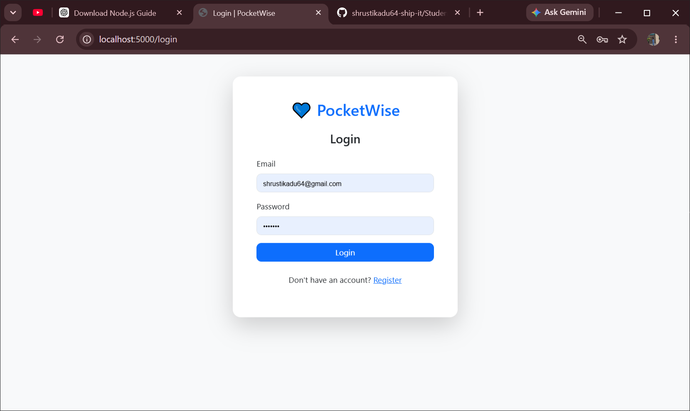
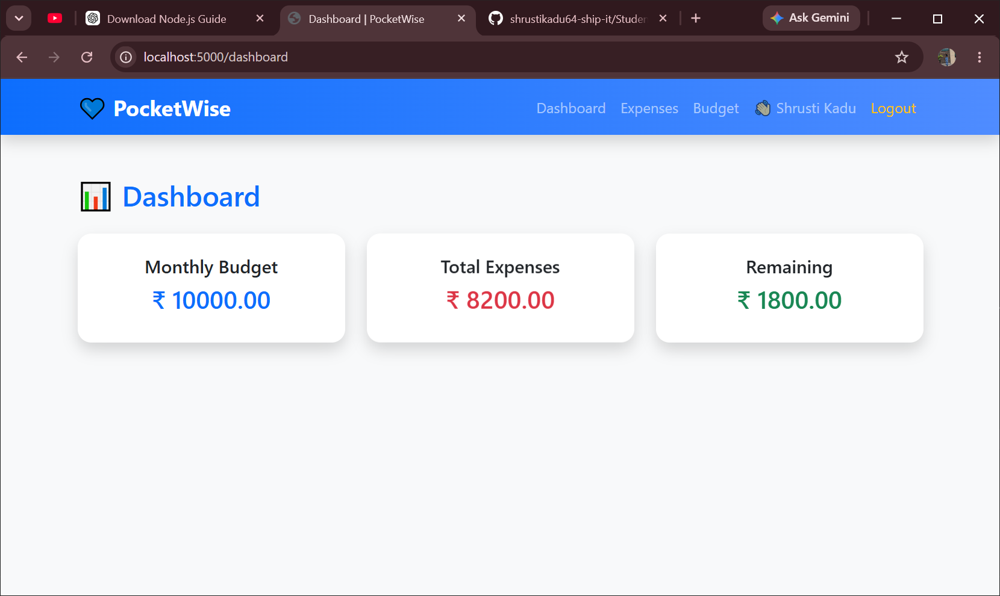
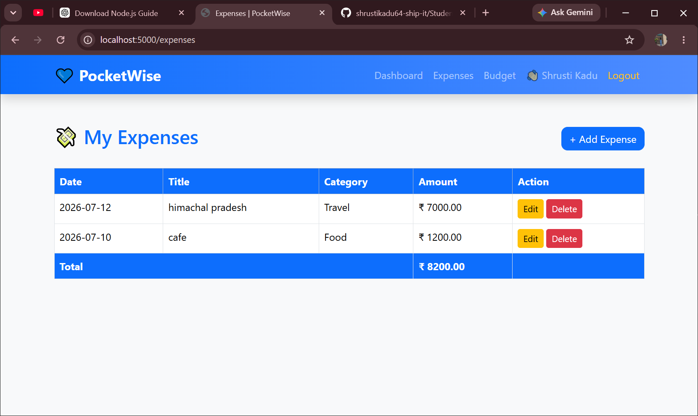
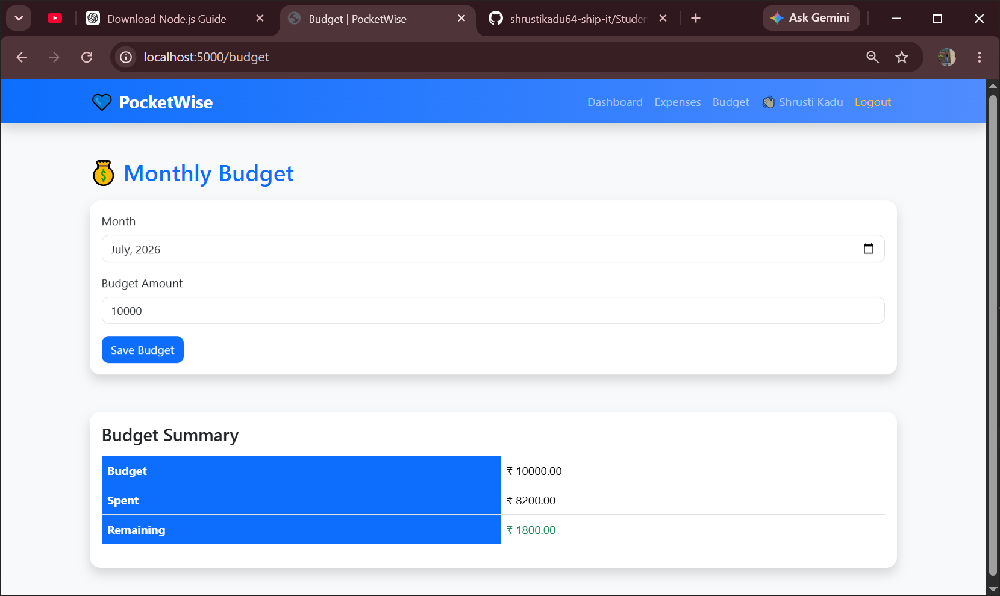

# 💰 Student Expense Tracker

A full-stack web application that helps students manage their daily expenses and monthly budget.

## 🚀 Features

- 👤 User Registration & Login
- 🔒 Secure Password Hashing using Bcrypt
- 📊 Dashboard with Expense Summary
- 💸 Add, Edit & Delete Expenses
- 📅 Track Expenses by Date
- 💰 Set Monthly Budget
- 📈 Remaining Budget Calculation
- 🔐 Session-Based Authentication
- 💬 Flash Messages
- 🎨 Responsive User Interface

---

## 🛠️ Tech Stack

### Frontend
- HTML
- CSS
- JavaScript
- Bootstrap 5
- EJS

### Backend
- Node.js
- Express.js

### Database
- MongoDB
- Mongoose

### Authentication
- Express Session
- Bcrypt

---

## 📂 Project Structure

```
## ⚙️ Installation

Clone the repository:

```bash
git clone https://github.com/shrustikadu64-ship-it/Student-expense-tracker.git
```

Go to the project folder:

```bash
cd Student-expense-tracker
```

Install dependencies:

```bash
npm install
```

Create a `.env` file:

```env
PORT=5000
MONGO_URI=your_mongodb_connection_string
SESSION_SECRET=your_secret_key
```

Run the project:

```bash
npm run dev
```

Open your browser:

```
http://localhost:5000
```

---

## 📸 Screenshots

<table>
<tr>
<td align="center">
<b>🔐 Login Page</b><br><br>

</td>

<td align="center">
<b>📊 Dashboard</b><br><br>

</td>
</tr>

<tr>
<td align="center">
<b>💸 Expenses</b><br><br>

</td>

<td align="center">
<b>💰 Budget</b><br><br>

</td>
</tr>
</table>

## 👩‍💻 Author

**Shrusti Kadu**

GitHub:
https://github.com/shrustikadu64-ship-it

---

## 📄 License

This project is created for educational purposes.
